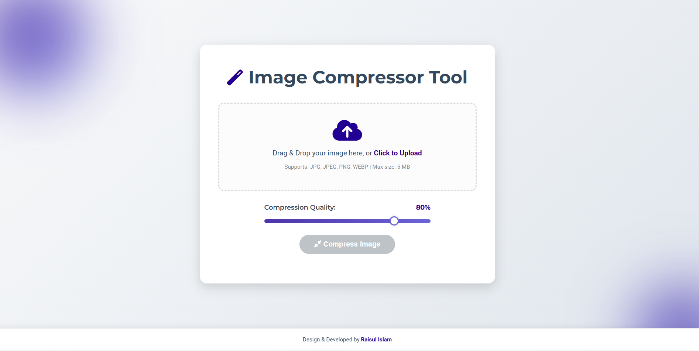
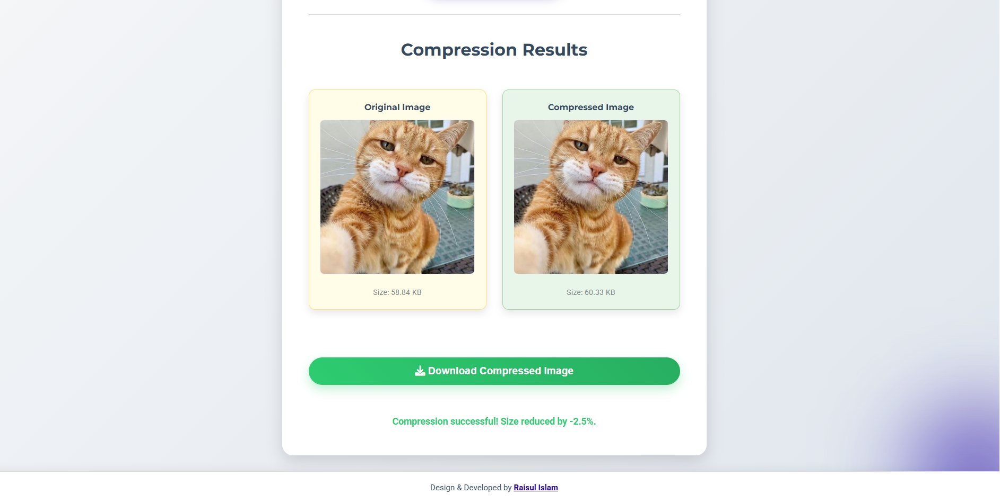

# Image Compressor Tool - Client Side (HTML/JS)

A Simple high-performance, modern web-based tool designed to **compress and optimize images** (JPG, JPEG, PNG, WEBP) right in the user's browser. This tool features a unique, deep purple gradient design and provides instant visual and size feedback.

---

## 🚀 Features

- **Client-Side Compression:** Uses the native **HTML Canvas API** (`canvas.toBlob`) to compress images directly in the browser, ensuring **user privacy** and instant results without server communication.
- **Max File Size Validation:** Enforces a **5 MB limit** for the uploaded file.
- **Compression Quality Control:** Includes a **range slider** for users to precisely adjust the compression quality (1% to 100%).
- **Instant Result Visualization:** Shows side-by-side **Original vs. Compressed** image previews along with their respective file sizes and total size reduction percentage.
- **Download Option:** Supports direct downloading of the single compressed file.
- **Modern UI/UX:** Features a **Deep Purple gradient** (`#220093` to `#453ECE`), bold typography, and a prominent drag-and-drop area.
- **Single-File Deployment:** The entire application (HTML, CSS, and JavaScript) is contained within one file for easy sharing and deployment.

---

## 🖼️ Screenshots
1. Home page. 
2. Compressed Page. 

---

## ⚙️ Installation & Usage

This is a single-file, client-side application, requiring no server or dependencies.

1.  **Clone the repository** (or download `image_compressor_tool.html` HTML file).
2.  Open the **`image_compressor_tool.html`** file directly in any modern web browser.
3.  **Upload/Drag & Drop** your image (JPG, JPEG, PNG, WEBP).
4.  Adjust the **Compression Quality** slider.
5.  Click the appropriate **Compress** button.
6.  Download your optimized image.

## ✨ Technologies Used

- **HTML5 & CSS3** - Provides the structure and the **unique, responsive** design with custom gradients and styling.
- **JavaScript (Vanilla)** - Contains the core logic for file handling, validation, UI state changes, and driving the compression process.
- **HTML Canvas API** - The fundamental technology used for **client-side image manipulation and compression** (`.toBlob()`).
- **FileReader API** - Used for reading local file data to generate immediate image previews in the browser.
- **Font Awesome Icons** - Used for professional and clear visual indicators across the UI.
- **Google Fonts** - Incorporates `Montserrat` and `Roboto` fonts for modern typography.

---

## 💡 Contact & Support

This project was developed by:

**Raisul Islam**
-   Website: [shagor.dev](https://shagor.dev)
-   Email: deploy@shagor.dev

---

## 🎁 License & Usage

This tool is a **gift for personal use**. You are free to use, modify, and share this code for any personal and non-commercial purposes. It is a token of goodwill and a demonstration of coding with faith.

***Commercial use is not permitted under this license.***
